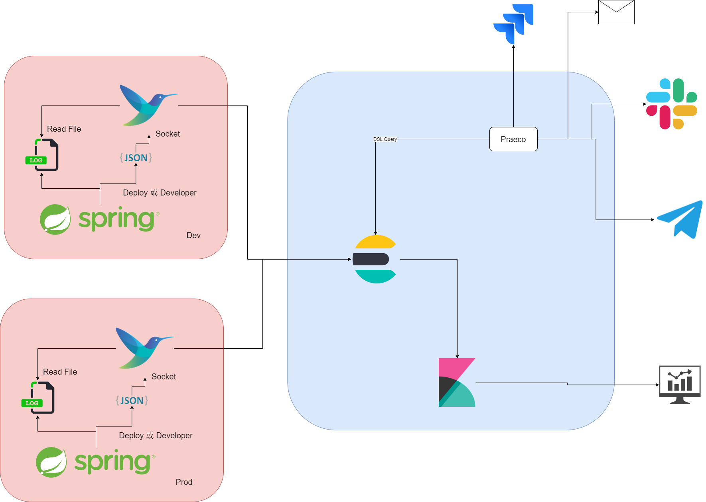

# docker-efk
Log collection
## fluent 配置檔範例 

```bash
$ ls fluent/conf/
read  socket
```
read 用於讀容器的日誌檔範例，無法明確知道是哪個容器傳送的 log，閱讀性沒 socket 方式高
socket 用於在 docker-compose 上配置將 log 透過 socket 方式傳至 fluentd
## Docker-compose 
```yaml
    logging:
      driver: fluentd
      options:
        fluentd-address: 192.168.101.129:24224
        tag: web-backend
```

在過程中發現先前已開發完的應用程式，要如何區分開發環境，以利於分析時做區分使用以下打 `labels` 方式。抑或著在在開發的應用程式上進行打標籤的動作來識別，以 spring boot 來說可以在 logback 中定義。

```yaml
logging:
      driver: fluentd
      options:
        fluentd-address: "192.168.101.129:3003"
        labels: "production_status"
    labels:
      production_status: "dev"
```

## 注意
1. 配置檔名稱需要是 fluent-bit.conf，否則會出現無法讀取到檔案的問題

# EFK
## Elasticsearch

特點
- 分散式的即時文件儲存，每個字段都可被索引並可搜索
- 分散式即時分析搜索引擎
    - 不規則查詢
- 高擴展，可處裡 PB 級*結構*或*非結構*化數據
- Lucene 實現索引和搜索功能

透過簡單的 RESTful API 來隱藏 Lucene 的複雜性，讓搜索變簡單

### ES 能做什麼
- 全文檢索
- 模糊查詢
- 數據分析
    - 聚合等

### Elasticsearch 的交互方式
- 基於 HTTP 協定，以 JSON 為數據交互格式的 RESTful API

## Fluentd
- log processor tool

在數據來源不段增加下它有以下特性
- 不同的信息來源 
- 不同的數據格式 
- 數據可靠性 
- 安全 
- 靈活的路由 
- 多個目的地
### 概念
##### Event or Record
每個傳入數據（Log、Metric）都視為一個事件(Event)或記錄(Record)

```bash=
Mar  8 10:03:36 ubuntu dockerd[18162]: time="2021-03-08T10:03:36.491688014+08:00" level=info msg="NetworkDB stats ubuntu(857ee003b9b7) - netID:zkgfqq2qthpzdtgrk2w3clhqo leaving:false netPeers:1 entries:2 Queue qLen:0 netMsg/s:0"
Mar  8 10:03:36 ubuntu dockerd[18162]: time="2021-03-08T10:03:36.493309528+08:00" level=info msg="NetworkDB stats ubuntu(857ee003b9b7) - netID:6r7udn06llggcz5awzjfm992m leaving:false netPeers:1 entries:3 Queue qLen:0 netMsg/s:0"
Mar  8 10:07:43 ubuntu systemd[1]: Started Session 124 of user xxxx.
Mar  8 10:08:36 ubuntu dockerd[18162]: time="2021-03-08T10:08:36.691648447+08:00" level=info msg="NetworkDB stats ubuntu(857ee003b9b7) - netID:zkgfqq2qthpzdtgrk2w3clhqo leaving:false netPeers:1 entries:2 Queue qLen:0 netMsg/s:0"
```

上面提供的日誌共有 4 個獨立事件，而每個事件由一些特定的組件組合，像是 TIMESTAMP、MESSAGE 等。
##### Filtering
對事件進行修改或刪除都視為過濾(Filtering)。

範例
- 為事件新增 IP 位置
- 選擇特定事件內容
- 刪除與特定模式匹配的事件
##### Tag
被轉發至 Fluent Bit 的每個事件都被分配一個標籤(Tag)。標籤是一個內部字串，路由器在之後階段用它確定它必須經過哪個 `Filter` 或  `Output` 階段。

input 為 Forward 是不分配標籤。標記必須始終匹配規則，這與[路由](https://docs.fluentbit.io/manual/concepts/data-pipeline/router)會有關連。

##### Timestamp
用於表示創建事件的時間，每個事件都會包含。
##### Match
Fluentd bit 允許將收集和處理的事件透過路由傳遞到一個或多個目的地，這是使用匹配(Match)來完成。

匹配是一個簡單的規則，用於選擇與標籤(Tag)匹配已定義規則的事件。

##### Structured Message
來源端數據可以是結構或是非結構化。結構化可以有 Key:Value 格式，並在做過濾時可更加方便。

### Buffering 性能與數據安全
Fluent Bit 處理數據時，使用系統記憶體堆作為主要和臨時的位置來儲存事件，接著再將它們發送到私有儲存區中，以處理事件。可以這麼的理解用於將處理後的數據放置到臨時位置，直到準備好發送為止

在記憶體中緩衝是一個最快的機制，緩衝(Buffering)是一個儲存事件的位置，在處理和提交事件時，仍然能夠儲存事件。

當獲取第三方服務事件時，該服務的網路故障或延遲非常普遍時，當接收到要處理的新數據時無法夠快交付數據時，將可能會面臨`backpressure`，使得記憶體大量被消耗。而 `Mem_Buf_Limit` 能夠抑制獲取的事件數據量，進而避免。

### Data Pipeline

整體資料流程如下圖所示


每個步驟都有相關的套件可使用

- Input
    - 定義來源來收集數據
- Parser
    - 從非結構化數據轉換為結構化數據
- Filter
    - 在將數據傳遞到某個目的地之前對其進行更改
- Buffer
    - 提供一種統一持久性機制來儲存數據
    - 此步驟處於不可變狀態的數據，因此無法再使用 Filter 進行處裡
- Routing
    - 藉由 Filter 將數據路由到一個或多個目的地
    - 依賴 Tag 和 Match 規則

範例

```bash=
[INPUT]
    Name cpu
    Tag  my_cpu

[INPUT]
    Name mem
    Tag  my_mem

[OUTPUT]
    Name   es
    Match  my_cpu

[OUTPUT]
    Name   stdout
    Match  my_mem # 為了將數據輸出至目的，因此必須做匹配動作
```

- Output
    - 定義數據的目的地

### Buffering & Storage
##### Chunks
當 Input 插件發出事件時，會將事件分組成一個塊(Chunk)，通常是 2Mb，預設下塊都在記憶體中創建。
##### Buffering and Memory
記憶體是一個很快的機制，對系統附載也小。但當網路發生問題或是有延遲，導致服務無法以正常速率進行傳送事件，此使記憶體的消耗將大幅增加並不斷累積數據，使得數據超出了傳遞的大小。這將有機會觸發 OOM，因此可使用 `mem_buf_limit` 方式進行限制，當超過 `mem_buf_limit` 限制則 Input 會暫停運作，同時間遺失數據的可能性將增加。

##### Filesystem buffering to the rescue
使用 Filesystem 緩衝有助於 backpressure 和記憶體控制。

為 Input 進行記憶體和檔案系統緩衝的配置將會有性能和數據安全的優勢。使用 Filesystem 時系統會將塊(Chunk)映射至硬碟上形成一個副本，同時會控制塊的量以處裡記憶體高使用率和 backpressure 產生的作用。

`storage.max_chunks_up` 預設為在記憶體儲存 128 個塊。在能夠使用塊下能夠進行交付或接收數據，剩下的塊是非啟用狀態這些將會用在檔案系統中，除非可進行交付，否則不再記憶體中使用。

當 Input 啟用 `mem_buf_limit` 和 `storage.type` 作為檔案系統，當 `mem_buf_limit` 達到閾值時，不是暫停 Input，而是所有新數據將轉到檔案系統中已關閉的塊(Chunk)。這控制了記憶體也保證數據不遺失。

##### Limiting Filesystem space for Chunks
塊(Chunk)也許會透過 Tag 將其路由至目的地。而目的地可以有很多個目標，而每個傳送到目標的速率將會不一樣，而這不一樣將會使其中一個目標產生 `backpressure`。可透過 `storage.total_limit_size` 進行限制，該限制當被觸發時，輸出到目的地的隊列中最舊的塊(Chunk)將被丟棄。

相關的儲存配置可參考此[鏈接](https://docs.fluentbit.io/manual/administration/buffering-and-storage#service-section-configuration)

### Monitor
[monitoring](https://docs.fluentbit.io/manual/administration/monitoring)

## Kibana

## 應用
架構如下圖



藍色為一台主機，而紅色是不同開發環境的主機，`fluent` 充當 agent，在每台主機蒐集 log 並將其傳送至 Elasticsearch 上，後須搭配 `Praeco` 實現 log 告警。


在 `fluent-bit` 配置如下，Filter 可以想成是 pipeline 概念。
```bash=
[SERVICE]
    flush            1
    log_Level        info
    daemon           off
    parsers_File     parsers.conf

# use driver method
[INPUT]
    name   forward
    listen 0.0.0.0
    port   24224
    tag    docker.socket
# use read
[INPUT]
    name              tail
    tag               docker.file
    path              /fluentd/log/containers/web.log
    DB                /var/log/flb_docker.db
    mem_buf_limit     5MB
    skip_long_lines   Off
    refresh_interval  10
    Docker_Mode On
    Docker_Mode_Flush 4
    Docker_Mode_Parser multiline2 # 捕獲 JAVA Exception Stack

[FILTER]
    Name parser
    Match docker.socket
    Key_Name log
    Parser spring # 解析 JAVA log 
    Reserve_Data On
    Preserve_Key On

[FILTER]
    Name parser
    Match docker.file
    Key_Name log
    Parser docker # 處裡 Json
    Reserve_Data On 
    Preserve_Key On

[FILTER]
    Name parser
    Match docker.file
    Key_Name log
    Parser h365
    Reserve_Data On # 將原始直對保留在解析的結果中
    Preserve_Key On # 將原始的 Key_Name 字段保留在解析的結果中
# 新增 Tag
[FILTER]
    Name record_modifier
    Match docker.file
    Record production_status dev
    Record container_name web
    Remove_key time


[OUTPUT]
    name             es
    match            *
    host             192.168.101.129
    port             3001
    index            fluent-bit
    logstash_format  on
    logstash_Prefix  120.log
    logstash_dateformat %Y%m%d
    replace_dots     on
    retry_limit      false
```

parser

```bash=
[PARSER]
    Name spring
    Format regex
    Regex /^(?<time>((\d)+((-|:)\d+)+(\W+)\S+)+)(\s)?(?<level>\S+)\W+(?<logger>\S+)\W+(?<message>(\S|\s)*)/
    Time_Key  time
    Time_Format %b %d %H:%M:%S

[PARSER]
    Name multiline2
    Format regex
    Regex /(?<log>^{"log":"((\d)+((-|:)\d+)+.*))/

[PARSER]
    Name        docker
    Format      json
    Time_Key    time
    Time_Format %Y-%m-%dT%H:%M:%S.%L
    Time_Keep   On

[PARSER]
    Name h365
    Format regex
    Regex /^(?<time>((\d)+((-|:)\d+)+))(\S)+(\s)+(?<thread>(\S)+)(\W)+(?<level>\S+)(\W+)(?<message>(\S|\s)*)/
    Time_Key  time
    Time_Format %b %d %H:%M:%S
```

用 `--log-driver` 轉發

```bash=
docker run -it -d -p 80:80 --log-driver fluentd  --log-opt fluentd-address=tcp://192.168.101.129:24224 --log-opt labels=production_statu
s=testing --log-opt tag=web nginx
```

使用 docker-compose logging 設定進行日誌轉發，此方式本地不會儲存 Log，配置如下

```yaml
    logging:
      driver: fluentd
      options:
        fluentd-address: "192.168.101.120:24224"
        tag: "spring boot"
        labels: "production_status"
    labels:
      production_status: "dev"
```

會存在無法分辨是哪個容器產生，因此使用 `labels` 關鍵字實現自訂義標籤。這樣可用來解決分辨問題源，可參考此[鏈接](https://fluentbit.io/articles/docker-logging-elasticsearch/)。