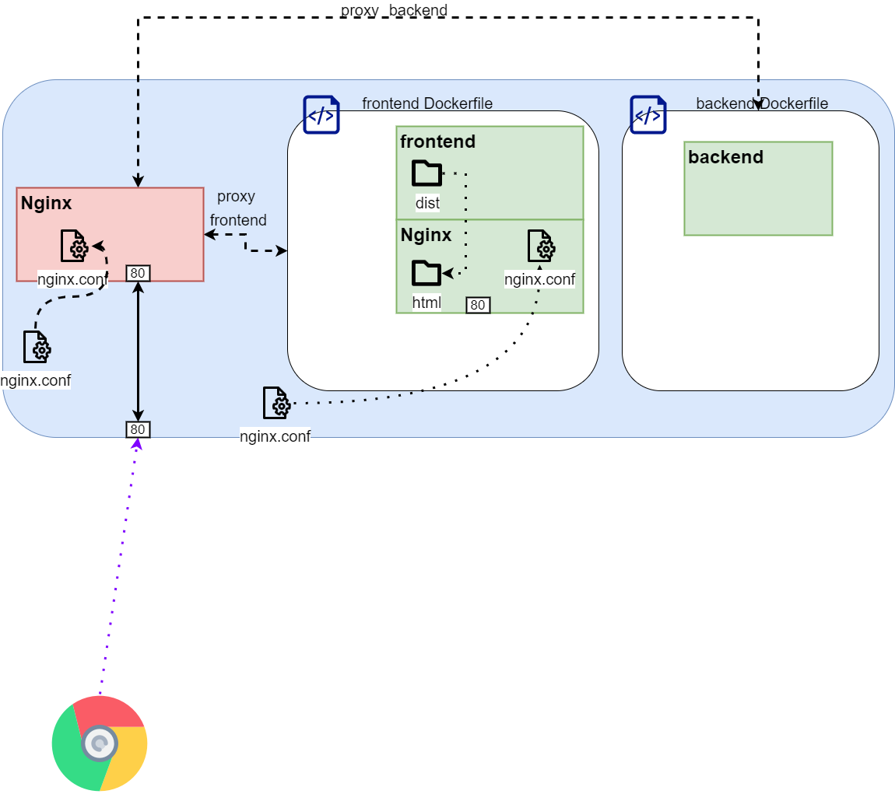
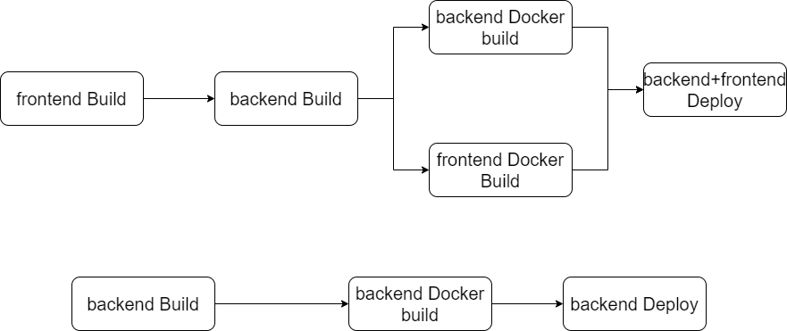

## Proxy
前後端分離架構如下圖，


前端將靜態檔案做打包，並搭配一個 `nginx` 針對靜態服務提供一個接口，其配置如下

```nginx=
server {
        listen 80;
        location / {
                root /usr/share/nginx/html;
                index index.html index.htm;
                try_files $uri $uri/ /index.html;
        }
        location ^~ /static/ {
                autoindex off;
                alias /usr/share/nginx/html/static/;
                expires 30d;
    }
}
```

後端部分也是打包，但外部會再搭配一個 `Nginx` 進行反向代理，當請求 `/` 時會導向前端，而當對 `/api/` 進行操作時則會導向後端。

```nginx=
map $scheme $proxy_port {
    "http"  "80";
    "https" "443";
    default "80";
}
server {
    listen 80;
    server_name localhost;
    add_header Strict-Transport-Security "max-age=31536000; includeSubDomains; preload" always;
    client_max_body_size 20m;
    server_tokens off;
    
    location / {
      proxy_pass http://fe_service/;
      proxy_connect_timeout 300s;
      proxy_read_timeout 300s;
      proxy_send_timeout 300s;
      proxy_set_header   Host             $host:$proxy_port;
      proxy_set_header   X-Real-IP        $remote_addr;
      proxy_set_header   X-Forwarded-For  $proxy_add_x_forwarded_for;
      proxy_set_header Via    "nginx";
    }

    location ^~ /api/ {
      proxy_pass http://be_service:8080/;
      proxy_connect_timeout 300s;
      proxy_read_timeout 300s;
      proxy_send_timeout 300s;
      proxy_set_header   Host             $host:$proxy_port;
      proxy_set_header   X-Real-IP        $remote_addr;
      proxy_set_header   X-Forwarded-For  $proxy_add_x_forwarded_for;
      proxy_set_header Via    "nginx";
    }
      

  location /swift/v1 {
    proxy_pass http://localhost:3004/v1;
    proxy_set_header   Host             $host:$proxy_port;
  }

}
```

這種方式改善了 CI/CD 的運行時間，先前都是打包前端在將檔案放到後端，在打包後端。此時不論只變更後端或前端都會全部一同打包這耦合性太高，分離之後效率有明顯提升些許。以下是 pipeline 改善前後流程

